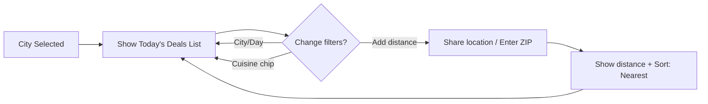

# BudgetTriad.com/KidsEatFree — V1 Specification (Locked)

## ✅ IMPLEMENTATION STATUS

### **COMPLETED (get-started branch)**
- ✅ **Database Schema & Connection** - Full Neon PostgreSQL setup with Drizzle ORM
- ✅ **Cities API** - `/api/cities` endpoint returning all launch cities
- ✅ **CitySelector Component** - Complete with tests, localStorage persistence, error handling
- ✅ **Budget Triad Homepage** - Main landing page with service cards layout
- ✅ **Kids Eat Free Section** - Dedicated route at `/kidseatfree` with city selection
- ✅ **Test Coverage** - 13/13 tests passing (components + pages)
- ✅ **TDD Approach** - Implemented following test-driven development

### **REMAINING WORK**
- 🔄 **Today's Deals Display** - Show deals for selected city/day
- 🔄 **Day Selection** - Filter by day of week  
- 🔄 **Deals List** - Mobile-first list with restaurant info
- 🔄 **Restaurant Detail Pages** - Lightweight detail view
- 🔄 **Tips & Flags** - Anonymous reporting system
- 🔄 **Distance & Sorting** - Location-based features

## 1) Goals & Scope
- **Goal:** On a phone, show **today’s** kids‑eat‑free deals for a chosen **City** fast; let users switch **Day/City**, optionally see **distance & nearest sort** (no map), submit **tips**, and make **anonymous one‑tap flags** at the **restaurant level**.
- **Launch cities:** Greensboro, High Point, Winston‑Salem, Kernersville, **Asheboro (NC Zoo)**.
- **Out of scope (V1):** Ads/affiliates, newsletter, FB community, maps, user accounts.

## 2) Core UX (Mobile‑first, List‑first)
- **Header controls:** **City** (remembers indefinitely), **Day** (defaults to Today), **Cuisine chips** (scrollable).
- **List row (two lines):**
  **Line 1:** Restaurant **name** (link).
  **Line 2:** **Cuisine • Day badge • Distance** (if available).
  Small **Verified** badge (when applicable) + **“Unverified reports”** tag if any open flags for that restaurant.
- **Distance (optional):** Prompt to share location or enter ZIP → show miles + **Sort: Nearest** (no map).
- **Detail page (lightweight):** Name, cuisines, rule text (if available), **Verified** badge/date, **Report issue** (one‑tap), **Suggest update** (tip), **Restaurant site**, **Open in Maps**.

## 3) EARS User Stories (V1)
[List of user stories from the full PRD]

## 4) Acceptance Criteria (samples)
[List of Gherkin-style criteria from the full PRD]

## 5) Visual Flows (Mermaid)
### Current Implementation Flow
```mermaid
flowchart LR
  A[Open BudgetTriad.com] --> B[Budget Triad Homepage]
  B --> C[Click Kids Eat Free Card]
  C --> D[/kidseatfree page]
  D --> E{Last city saved?}
  E -- Yes --> F[Show CitySelector with saved city]
  E -- No --> G[Show CitySelector dropdown]
  F --> H[User can change city]
  G --> H
  H --> I[Ready for deals display - NEXT FEATURE]
```

### Planned Deals Flow (Next Sprint)


### Tip/Flag sequence
```mermaid
sequenceDiagram
  participant U as User
  participant W as Web App
  participant S as Server
  participant DB as Database
  participant A as Admin

  U->>W: One-tap Flag (anonymous) or Submit Tip
  W->>S: POST /flags or /tips
  S->>DB: Save (flag) or Save {status: Unverified} (tip)
  S-->>W: 201 Created
  Note right of W: Show "Unverified reports" on flagged restaurants; tips show as Unverified
  A->>W: Admin Review (verify/update/remove/resolve)
  W->>S: PATCH /deals or /tips or /flags
  S->>DB: Update
  S-->>W: 200 OK
```

## 6) Technology Stack
- **Frontend:** Next.js (React framework)
- **UI Components:** shadcn/ui (component library)
  - **Components Location:** `src/components/ui/` (all components pre-installed)
  - **Usage:** Import from `@/components/ui/[component-name]`
  - **Available Components:** accordion, alert-dialog, alert, aspect-ratio, avatar, badge, breadcrumb, button, calendar, card, carousel, chart, checkbox, collapsible, command, context-menu, dialog, drawer, dropdown-menu, form, hover-card, input-otp, input, label, menubar, navigation-menu, pagination, popover, progress, radio-group, resizable, scroll-area, select, separator, sheet, sidebar, skeleton, slider, sonner, switch, table, tabs, textarea, toggle-group, toggle, tooltip
  - **Guidelines:** Use ONLY the pre-installed shadcn/ui components. Do not install additional UI libraries or create custom components that duplicate shadcn functionality.
- **Styling:** Tailwind CSS
- **Database:** Neon (PostgreSQL) with Drizzle ORM
  - **ORM:** Drizzle ORM (`drizzle-orm/neon-http`)
  - **Schema Location:** `src/db/schema.ts` (pre-configured with all tables)
  - **Database Utils:** `src/lib/database.ts` (utility functions for common operations)
  - **Connection:** `src/db/index.ts` (database connection instance)
  - **Scripts:**
    - `npm run db:push` - Push schema changes to database
    - `npm run db:generate` - Generate migration files
    - `npm run db:migrate` - Apply migrations
    - `npm run db:studio` - Open Drizzle Studio
    - `npm run db:seed` - Seed database with sample data
  - **Usage:** Import from `@/lib/database` for utility functions or `@/db` for direct database access
  - **Guidelines:** Use the pre-built utility functions in `src/lib/database.ts` for common operations. For complex queries, import `db` and schema tables directly.
- **Deployment:** Vercel (recommended for Next.js)

## 7) Architecture Overview
### Component diagram
```mermaid
graph TD
  M[Mobile Web UI] --> API[Backend API]
  API --> DB[(Database)]
  API --> LOC[Distance Helper]
  M -->|Tips/Flags| API
  API --> ADMIN[Admin UI (secure)]
```

## 8) Data & API
### ER (V1, restaurant‑level flags)
```mermaid
erDiagram
  CITY ||--o{ RESTAURANT : has
  RESTAURANT ||--o{ DEAL : offers
  RESTAURANT }o--o{ CUISINE : typed_as
  RESTAURANT ||--o{ FLAG : receives
  RESTAURANT ||--o{ TIP : receives

  CITY { int id PK; string name; string slug; float center_lat; float center_lng }
  RESTAURANT { int id PK; string name; string website_url; float lat; float lng; int city_id FK; boolean active }
  CUISINE { int id PK; string name; string slug }
  DEAL { int id PK; int restaurant_id FK; string day_of_week; string rule_text; boolean verified; datetime verified_at }
  TIP { int id PK; int restaurant_id FK; string message; string source_url; datetime created_at; boolean verified; datetime verified_at }
  FLAG { int id PK; int restaurant_id FK; string reason; datetime created_at; boolean resolved; datetime resolved_at }
```

## 9) API Summary (V1)
- **GET** `/deals?...` → `ListItem[]`
- **GET** `/restaurants/:id`
- **POST** `/tips` → creates Unverified tip
- **POST** `/flags` → anonymous flag
- **PATCH (Admin)** `/tips/:id`, `/deals/:id`, `/flags/:id`

## 10) Admin (V1)
- Review queue for Unverified tips, Open flags.
- Approve, edit, remove, or resolve.

## 11) Quality Bar
- First list paint ≤ 3s on mobile.
- Change filters in ≤2 taps.
- Anonymous flag in ≤3s with “Unverified reports” tag.
- A11y: large tap targets, high contrast, accessible navigation.

## 12) Monetization (V1 Placeholder Ads)
- “Promote Your Business” CTA links to submission form (name, business, message).
- Static ad placeholders labeled “Ad” or “Sponsored” above list or sidebar.
- Simple layout, no animations, consistent brand style.